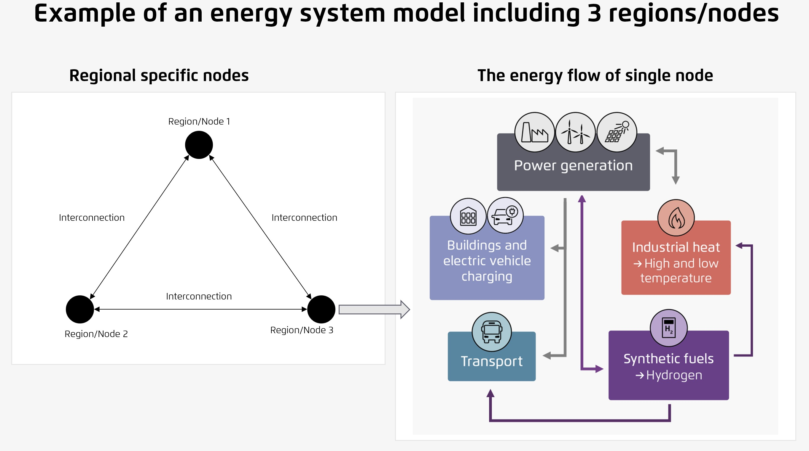

<!--
-*- coding: utf-8 -*-
SPDX-FileCopyrightText: PyPSA-SPICE Developers
SPDX-License-Identifier: GPL-2.0-or-later
-->

# PyPSA-SPICE: PyPSA-based Scenario Planning and Integrated Capacity Expansion

<!-- badges-begin -->
[![License][license badge]][license]
[![Snakemake][Snakemake badge]][Snakemake]
[![Code style][Code style badge]][Code style]
![Status][status badge]

[license badge]: https://eddelbuettel.github.io/badges/GPL2+.svg
[license]: https://www.gnu.org/licenses/old-licenses/gpl-2.0.en.html

[Snakemake badge]: https://img.shields.io/badge/snakemake-minimal==8.10.8-brightgreen.svg?style=flat
[Snakemake]: https://snakemake.readthedocs.io

[Code style badge]: https://img.shields.io/badge/code%20style-black-000000.svg
[Code style]: https://github.com/ambv/black

[status badge]: https://img.shields.io/badge/under%20construction-ffae00
<!-- badges-end -->

This open-source project is led by [Agora Energiewende](https://www.agora-energiewende.org/), with support from [CASE for Southeast Asia](https://caseforsea.org/) and the [International Network of Energy Transition Think Tanks (INETTT)](https://www.inettt.org/).

> [!TIP]
> If you are considering using this model builder, please reach out to us at [edm-training@agora-thinktanks.org](mailto:edm-training@agora-thinktanks.org). We would be happy to help you get started.
> If you encounter a bug, please create a [new issue](https://github.com/agoenergy/pypsa-spice/issues). For new ideas or feature requests, you can start a conversation in the [discussions](https://github.com/agoenergy/pypsa-spice/discussions) section of the repository.

PyPSA-SPICE is an open-source model builder for assessing national mid/long-term energy scenarios using a least-cost, multi-sectoral optimization approach based on the [PyPSA](https://pypsa.org/) framework. It can be used to build models that represent one or more countries across multiple interconnected nodes linked by electricity transmission, and within each region, it models the integration of power, heat, and transport sectors. The model focuses on the power sector, which is represented with a high level of detail.

The model workflow has been designed to be more accessible compared to other PyPSA-based models, though basic Python coding knowledge is required.

<!-- markdownlint-disable MD033 -->
<a href="docs/assets/images/pypsa-spice_intro.jpg">
<picture>
  <source media="(prefers-color-scheme: dark)" srcset="docs/assets/images/pypsa-spice_intro.jpg">
  
</picture>
</a>
<!-- markdownlint-disable MD033 -->

## Quick Installation

In order to install the application, first make sure you have _git_, _conda_ and optionally _mamba_ installed.

Then, clone the source code from GitHub onto your local machine and navigate into the `pypsa-spice` directory. Finally, use the provided `environment.yaml` file to create the _conda_ environment.

```bash
git clone https://github.com/agoenergy/pypsa-spice.git
cd pypsa-spice
conda env create -f envs/environment.yaml
```

> **Note:** _mamba_ is a faster replacement for _conda_, but its installation is not mandatory. You can use _conda_ instead if you prefer. For installation of _mamba_, please refer to the [installation Guide](docs/getting-started/installation.md#install-python-dependencies)

Once _mamba_ is installed, you can also create the environment more quickly using:

```bash
mamba env create -f envs/environment.yaml
```

## Execution of the Model Builder using Template Data

To have a first glance of how the model builder works, template data in [pypsa-spice-data](https://github.com/agoenergy/pypsa-spice/tree/main/data/pypsa-spice-data) folder can be used. After completing the installation, the following command can be executed to run the whole workflow at once. The command will use 1 core (`-j1`) and 1 thread (`-c4`) to execute. For more information, please refer to the [snakemake documentation](https://snakemake.readthedocs.io/en/stable/executing/cli.html) to adjust the cores and threads to use.

```bash
snakemake -j1 -c4 solve_all_networks
```

or

```bash
snakemake -call
```

For more information, please follow the guidance in this documentation website.

## Citing PyPSA-SPICE

Please use the citation below:

- Agora Think Tanks (2025): PyPSA-SPICE: PyPSA-based Scenario Planning and Integrated Capacity Expansion

## Contributions

We welcome anyone interested in contributing to this project, and please have a look
at [Contributing Guide](docs/contributing/contributing.md) and our [Code of Conduct](docs/contributing/code_of_conduct.md).
If you have any ideas, suggestions or encounter problems, feel free to file issues
or make pull requests on GitHub.

## License

Copyright &copy; [PyPSA-SPICE Developers](docs/references/developers.md)

PyPSA-SPICE is licensed under the open source [GNU General Public License v2.0 or later](LICENSE)
with the following information:

The documentation is licensed under [CC-BY-4.0](LICENSES/CC-BY-4.0.txt).

The repository uses [REUSE](https://reuse.software/) to expose the licenses of its files.
