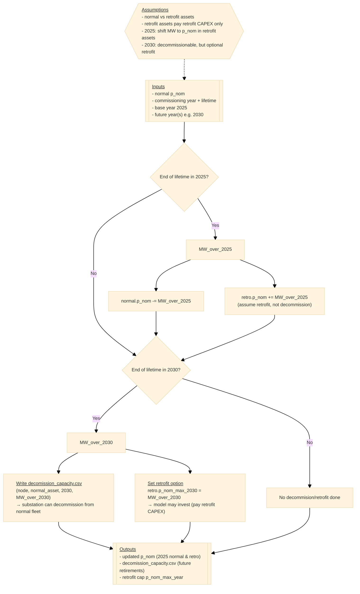

# Advanced settings in PyPSA-SPICE

## Decommissioning & retrofit logic

This note explains how PyPSA‑SPICE handles plant capacity that reaches the end of its technical lifetime **while you still want to allow the model to keep operating the plant by paying for a retrofit**. To represent this, each plant can be split into two **paired** assets:

- **Normal asset** (e.g., `XY_SO_COAL`) — the existing fleet/capacity  
- **Retrofit asset** (e.g., `XY_SO_COAL_RETRO`) — the portion that can be continued through retrofit investment  

!!! Note
    Key assumption: retrofit asset is treated as an **upgrade of the existing capacity**, so it pays **only the retrofit CAPEX** rather than the full greenfield cost of constructing a new plant.

### Logic overview

- **Base year (2025):** capacity that is already over-lifetime is **shifted** from the normal asset to the retrofit asset (treated as retrofitted, not decommissioned).

- **Future year (e.g., 2030):** capacity that becomes over-lifetime is written to `decomission_capacity.csv`. Hence, substations can **decommission** it from the normal fleet; the same amount becomes the **maximum retrofit investment option** via `retro.p_nom_max_2030`.

