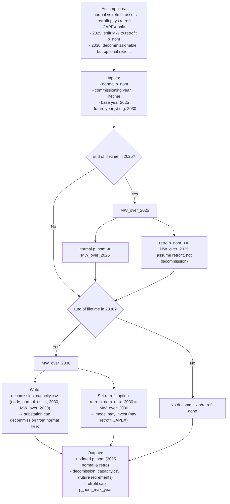

# PyPSA-SPICE Decommissioning & Retrofit Logic

This note explains how PyPSA-SPICE treats plant capacity that reaches the end of its technical lifetime **when you still want to allow the model to keep operating it by paying for a retrofit**. To represent this, each plant can be split into two **paired** assets:

- **Normal asset** (e.g., `XY_SO_COAL`) — the existing fleet/capacity  
- **Retrofit asset** (e.g., `XY_SO_COAL_RETRO`) — the portion that can be continued through retrofit investment  

Key assumption: the retrofit asset represents an **upgrade of existing capacity**, so it pays **only the retrofit CAPEX** (not the full cost of building a new plant).

## Logic overview

- **Base year (2025):** capacity that is already over-lifetime is **shifted** from the normal asset to the retrofit asset (treated as retrofitted, not decommissioned).
- **Future year (e.g., 2030):** capacity that becomes over-lifetime is written to `decomission_capacity.csv` so substations can **decommission** it from the normal fleet; the same amount becomes the **maximum retrofit investment option** via `retro.p_nom_max_2030`.

