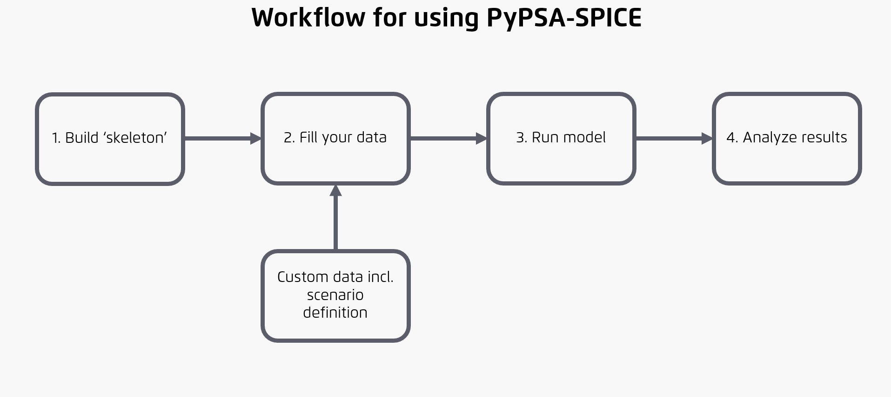

<!--
-*- coding: utf-8 -*-
SPDX-FileCopyrightText: PyPSA-SPICE Developers
SPDX-License-Identifier: GPL-2.0-or-later
-->

# Overview of workflow

The diagram below outlines the process for preparing and entering input data, running the model, and performing post-analysis along with visualization. The following sections provide additional details and guidance for each step.

<!-- Where can I find the file to edit this so I can make some changes?-->
<!-- markdownlint-disable MD033 -->
<a href="../../assets/images/pypsa-spice_workflow.jpg"> 
<picture>
  <source media="(prefers-color-scheme: dark)" srcset="../../assets/images/pypsa-spice_workflow.jpg">
  
</picture>
</a>
<!-- markdownlint-disable MD033 -->

!!! info
    If you are considering using this model builder, please reach out to us at [edm-training@agora-thinktanks.org](mailto:edm-training@agora-thinktanks.org){:target="_blank"}. We would be happy to help you get started.
    If you encounter a bug, please create a [new issue](https://github.com/agoenergy/pypsa-spice/issues){:target="_blank"}. For new ideas or feature requests, you can start a conversation in the [discussions](https://github.com/agoenergy/pypsa-spice/discussions){:target="_blank"} section of the repository.

**[1. Build skeleton:](../getting-started/input-data/new-model.md)** This is the initial step where you define the scope and resolution of the model and run a script to generate empty data files. At this stage, it is important to specify the regions must be included in the model

**[2. Fill data:](../getting-started/input-data/new-model.md/#step-3-fill-in-the-skeleton-csvs)** Use the generated empty CSV files to input your custom data. You can also create multiple scenarios with distinct data and conditions. We recommend maintaining a separate repository for storing and modifying your input data.

**[3. Run model:](../getting-started/input-data/model-builder-execution.md/#running-the-model-builder)** Execute the model with your defined scenarios via the command line.

**[4. Analyse results:](../visualisation-tool/pypsa-spice-vis.md)** Evaluate the model output using either Jupyter Notebook or locally run interactive app we provide - [PyPSA-SPICE-Vis](../visualisation-tool/pypsa-spice-vis.md).
