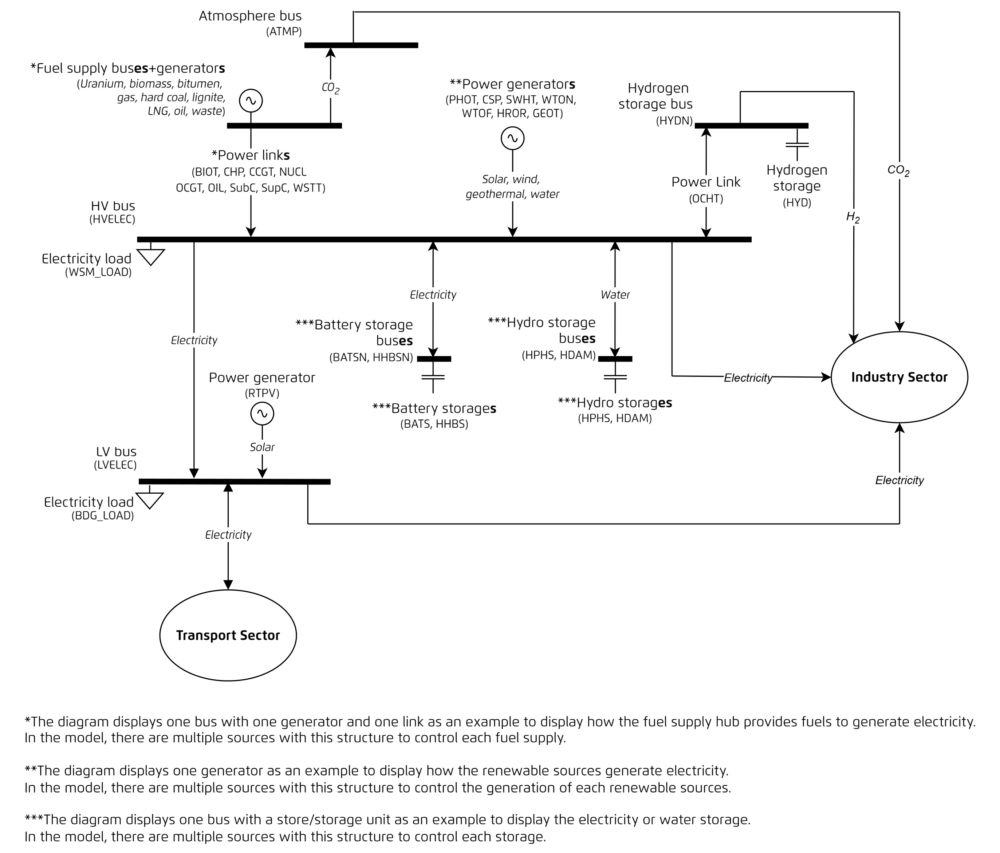

<!--
-*- coding: utf-8 -*-
SPDX-FileCopyrightText: PyPSA-SPICE Developers
SPDX-License-Identifier: GPL-2.0-or-later
-->

# Power sector

## Key features

- **Co-optimisation** of generation and capacity expansion including interconnections.
- **Myopic** (year-by-year) optimisation. Each year is optimised independently, without assuming knowledge of future developments.
- **Brownfield** modelling approach. The model builds on existing infrastructure, meaning capacity from previous years is retained and carried forward.

PyPSA-SPICE follows the component definitions from [PyPSA components](https://docs.pypsa.org/latest/user-guide/design/){:target="_blank"}. The diagram below illustrates all components involved in energy flows at a single node in the power sector.

[{ .img-center width="100%" }](../assets/images/pypsa-spice_schema_power_sector.jpg){: target="_blank" }

## Power generators

All the listed components are defined as `Generator` in PyPSA.

| Abbreviation  | Full Name                                |
| ------------- | ---------------------------------------- |
| `CSP`         | Concentrated solar power plant           |
| `GEOT`        | Geothermal power plant                   |
| `HROR`        | Hydro run-of-river                       |
| `PHOT`        | Solar PV                                 |
| `RTPV`        | Rooftop PV                               |
| `WTOF`        | Offshore wind                            |
| `WTON`        | Onshore wind                             |

## Power links

All the listed components are defined as `Link` in PyPSA.

| Abbreviation  | Full Name                                |
| ------------- | ---------------------------------------- |
| `BIOT`        | Biomass power plant                      |
| `CCGT`        | Combined-cycle gas turbine power plant   |
| `CHP`         | Combined heat and power plant            |
| `ELTZ`        | Electrolyser (for hydrogen production)   |
| `NUCL`        | Nuclear power plant                      |
| `OCGT`        | Open-cycle gas turbine power plant       |
| `OCHT`        | Open-cycle hydrogen turbine power plant  |
| `OILT`        | Oil turbine power plant power plant                  |
| `SubC`        | Subcritical coal-fired power plant       |
| `SupC`        | Supercritical coal-fired power plant     |
| `WSTT`        | Waste-to-energy power plant              |

## Storage capacity

The following component is defined as `StorageUnit` in PyPSA.

Storages can be modelled with two approaches.

1. **Fixed energy-to-power ratio:** In this case, the energy to power ratio for storage is predefined. You can use multiple storage type with different energy to power ratio. For example, `BATS` with E/P ratio of 4 and `BATS` with E/P ratio of 8 representing different energy to power ratio and the model will optimise the capacity of each of these technology. In this case, PyPSA type `Storage_units` can be used for modelling and defining the energy to power ratio in `technologies.csv`.
2. **Variable energy-to-power ratio:** If you want the model to optimise the energy/power ratio of storage your have to model it using a combination of `Links` + `Store` component. This requires separate inputs like costs for capacity and energy component of the storage inputs.

!!! Tip
    In PyPSA components, `StorageUnit` is modelled as a storage asset with a fixed energy-to-power ratio defined by `max_hours` of the nominal power (you can also refer to [PyPSA Components - StorageUnit](https://docs.pypsa.org/latest/user-guide/components/storage-units/){:target="_blank"} for more information). Thus, in PyPSA-SPICE model builder, hydro dam `HDAM` is defined as a `StorageUnit` and it is given in storage capcaity only to represent nominal power-related params.   
    To model the storage energy separately from the power capacity, `Store` + 2 `Links` is a better combination. You can refer to [Storage energy](power_sector.md#storage-energy) for more information. Technologies defined in the storage energy require storage capacity if the carrier is related to electricity (power).

| Abbreviation  | Full Name                                |
| ------------- | ---------------------------------------- |
| `HDAM`        | Hydro dam                                |
| `BATS`        | Utility-scale battery storage            |
| `HHBS`        | Household battery storage                |
| `HPHS`        | Hydro pumped storage                     |

## Storage energy

All the listed components are defined as `Store` in PyPSA.

!!! Tip
    In PyPSA components, `Store` is modelled as a storage asset with only energy storage. It can optimise energy capacity separately from the power capacity with a combination of `Store` + 2 `Links`. The links represent charging and discharging characteristics to control the power output. Marginal cost and efficiency of charging and discharging can be defined in each link.  
    In PyPSA-SPICE model builder, technologies that are defined as storage energy, **they should also be included in [Storage capacity](power_sector.md#storage-capacity) to describe charging and discharging processes. The links are created automatically , and hence it's not required to add charging and discharging links inside [Power links](power_sector.md#power-links).**  
    Detailed information and example can be found in [PyPSA Components - Store](https://docs.pypsa.org/latest/user-guide/components/stores/){:target="_blank"} and [Replace StorageUnits with fundamental Links and Stores](https://docs.pypsa.org/latest/examples/replace-generator-storage-units-with-store/){:target="_blank"}.

| Abbreviation  | Full Name                                |
| ------------- | ---------------------------------------- |
| `CO2STOR`     | CO~2~ storage                            |
| `BATS`        | Utility-scale battery storage            |
| `HHBS`        | Household battery storage                |
| `HPHS`        | Hydro pumped storage                     |

## Carriers

| Abbreviation  | Full Name                                                     |
| ------------- | ------------------------------------------------------------- |
| `Bio`         | Biomass                                                       |
| `Bit`         | Bituminous or brown coal                                      |
| `CO2`         | Carbon dioxide (in the atmosphere)                            |
| `Co2stor`     | Captured carbon dioxide                                       |
| `Electricity` | Electricity                                                   |
| `Gas`         | Domestic natural gas                                          |
| `Gas-imp`     | Imported natural gas                                          |
| `High_Heat`   | High-temperature heat (> 350°C)                               |
| `Hrdc`        | Anthracite or hard coal                                       |
| `Hyd`         | Hydrogen                                                      |
| `Lig`         | Lignite                                                       |
| `Lng`         | Liquefied natural gas                                         |
| `Low_Heat`    | Low-/Medium-temperature heat (< 350°C)                         |
| `Oil`         | Oil                                                           |
| `Uranium`     | Uranium                                                       |
| `Waste`       | Waste                                                         |

## Buses

| Abbreviation  | Full Name                     |
| ------------- | ----------------------------- |
| `ATMP`        | Atmosphere                    |
| `BATSN`       | Lithium battery storage       |
| `BION`        | Biomass                       |
| `BITN`        | Bituminous                    |
| `CO2STORN`    | CO~2~ storage                 |
| `GASN`        | Gas                           |
| `HHBSN`       | Household battery storage     |
| `HPHSN`       | Hydro pumped storage          |
| `HRDCN`       | Anthracite or hard coal       |
| `HVELEC`      | High-voltage electricity      |
| `HYDN`        | Hydrogen                      |
| `LIGN`        | Lignite                       |
| `LNGN`        | liquefied natural gas         |
| `LVELEC`      | Low-voltage electricity       |
| `NUCLN`       | Uranium                       |
| `OILN`        | Oil                           |
| `WSTN`        | Waste                         |

## Other components

| Abbreviation | Full Name                                               |
| ------------ | ------------------------------------------------------- |
| `co2Price`   | Price of emitting one unit of CO~2~ into the atmosphere |
| `r`          | Interest rate                                           |
| `HV_LOAD`   | Wholesale market load (high voltage level)              |
| `LV_LOAD`   | Building load (low/medium voltage level)                |

## Custom constraints (defined in the `config.yaml` file)

- CO2 management
- energy independence
- fuel production constraint
- reserve margin
- renewable generation share constraint
- must run constraint of thermal generators
- capacity factor constraint

You can refer to [Model builder constraints](../getting-started/input-data/model-builder-configuration.md) for more information.
